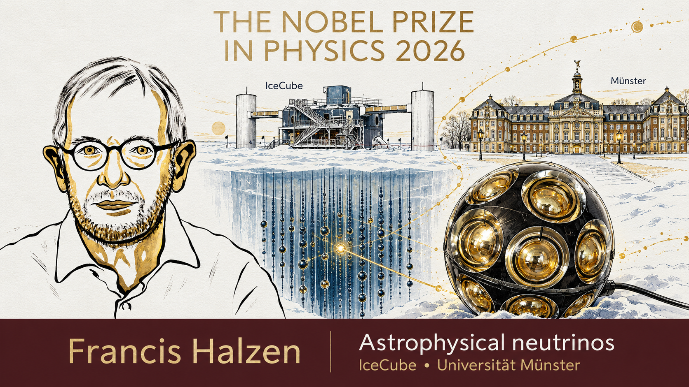
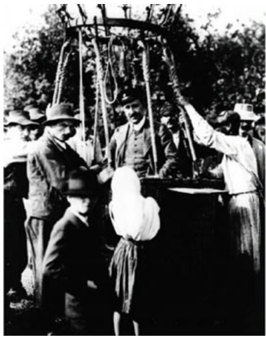
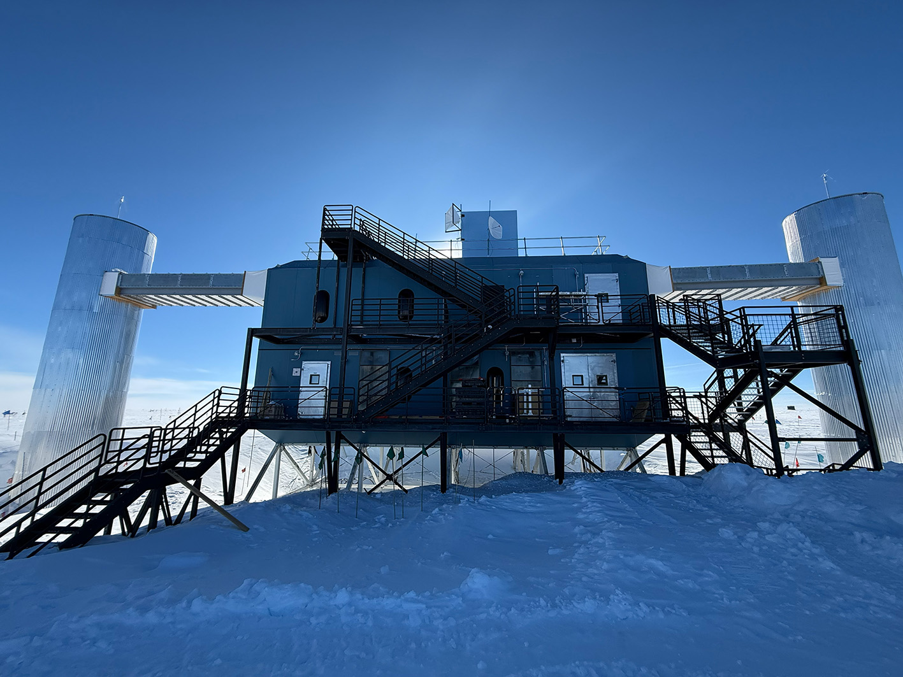
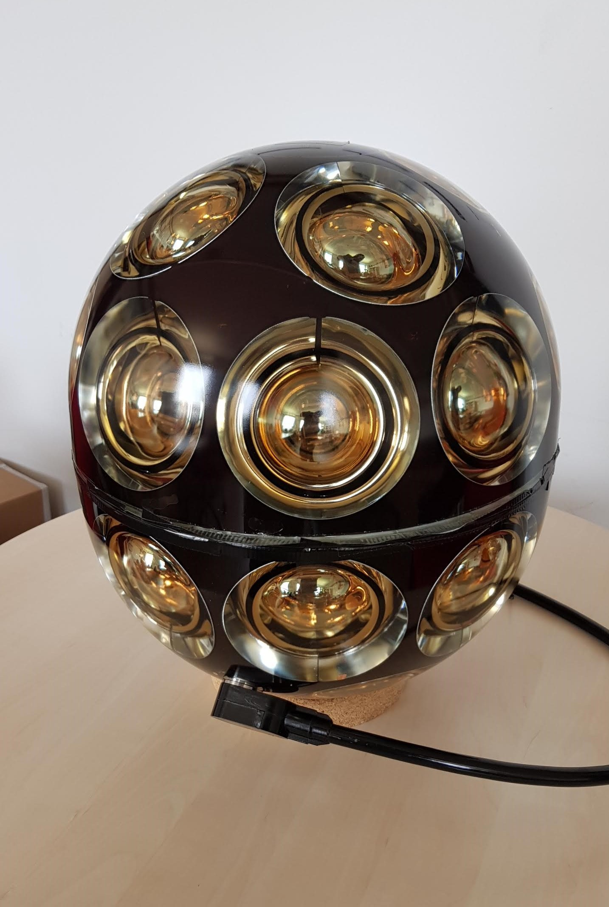
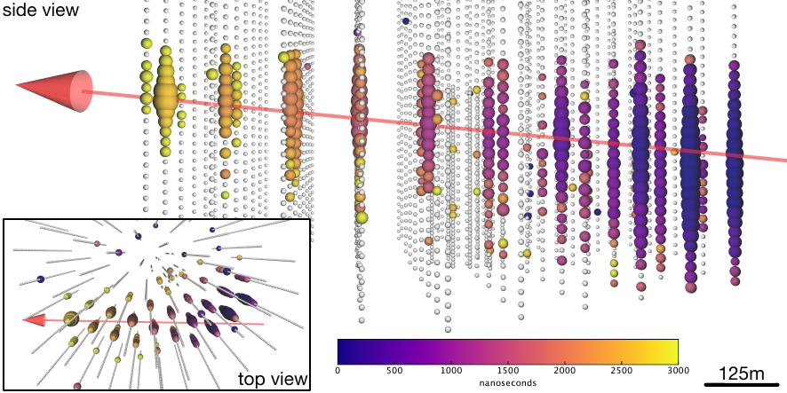
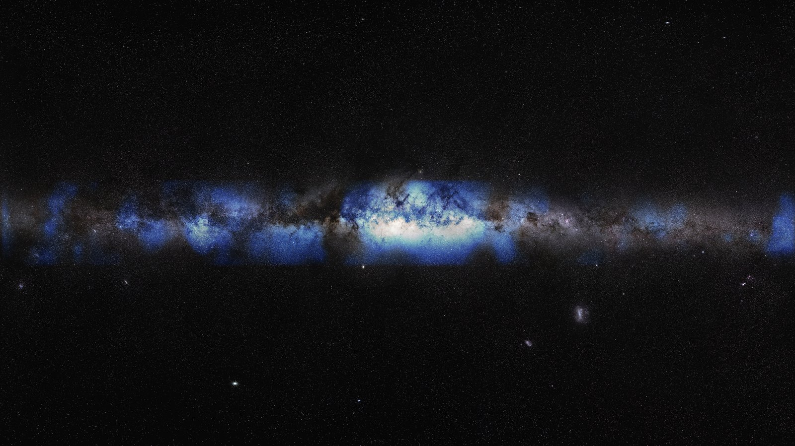

```{=html}
<div class="blog-feature">

</div>
```

## Why I'm writing this today

On 6 October 2026, the Nobel Prize in Physics went to [Francis Halzen](https://en.wikipedia.org/wiki/Francis_Halzen) of the University of Wisconsin–Madison. The Royal Swedish Academy of Sciences honoured him for his decisive role in building the [IceCube Neutrino Observatory](https://en.wikipedia.org/wiki/IceCube_Neutrino_Observatory) and for the discovery of "high-energy neutrinos of astrophysical origin". If you have never heard of IceCube, don't worry, that's exactly why I'm writing this.

For researchers who work on IceCube, this one feels personal. Halzen pushed, for decades, an idea that sounded completely mad: turn a cubic kilometre of Antarctic ice into a telescope, and use it to catch the most elusive particles we know. The chair of the Nobel committee, Mark Pearce, said his tenacity and vision opened the door to "a new kind of astronomy". I couldn't agree more. And it's been a long time since the physics prize went to a single person, which tells you something about how unique that vision was.

I work in the IceCube group at the University of Münster, where the group build and test the light sensors that go into the ice. 
So I want to take you on the whole journey: from a century-old puzzle about leaky electroscopes, through cosmic rays, strange muons and the history of the Universe, to the ghost particles called neutrinos, and finally to a hole in the ice at the South Pole. Grab a coffee. It's about a 25-minute read, and I promise only a couple of equations.

> **In a hurry? The whole story in five lines.**
> Something invisible has been raining down on Earth for ever; a man in a balloon proved in 1912 that it comes from space (cosmic rays). We still don't know exactly where they come from, because magnetic fields scramble their paths. Neutrinos are the one messenger that doesn't get scrambled, but they almost never interact with anything, so you need a cubic kilometre of detector to catch a few. Francis Halzen's answer was the clear ice under the South Pole. IceCube has since found neutrinos from a flaring black hole, from a hidden one, and from our own Milky Way, and the next sensors are being built right here in Münster.
>
> *Jump to: [cosmic rays](#1-a-leaky-electroscope-and-a-balloon-how-cosmic-rays-were-discovered) · [muons](#3-the-muon-a-particle-nobody-ordered-and-living-proof-of-einstein) · [cosmology](#4-zooming-out-what-experimental-cosmology-tells-us) · [neutrinos](#5-so-what-is-a-neutrino-a-desperate-remedy-and-a-missing-sun) · [cosmic accelerators](#7-neutrinos-from-the-wildest-places-in-the-universe) · [IceCube](#8-icecube-a-telescope-made-of-antarctic-ice) · [the Nobel Prize and Münster](#9-the-nobel-prize-2026-and-what-we-do-in-münster)*

Let me start with a fact that I still find hard to believe, even after years of working on this.

```{=html}
<div class="blog-figure">

</div>
```
<p class="blog-caption"><strong>Figure 1</strong>: A cartoon of solar neutrinos passing through you and the Earth.</p>
While you read this sentence, tens of billions of neutrinos from the Sun cross every square centimetre of your body, every single second. 
You don't feel them, nothing happens, and almost all of them leave through the other side of the Earth as if it wasn't there. 
Catching even a handful of them takes an enormous detector. Catching the rare ones from the most violent places in the universe takes a detector the size of a mountain. That's IceCube.

## 1. A leaky electroscope and a balloon: how cosmic rays were discovered

Our story starts with a very humble instrument: the electroscope. Simply, this is a glass jar with a metal rod and two thin gold leaves hanging from it. Charge the rod, and the leaves push each other apart. That's it. Simple, elegant, and it should stay like that forever if the jar is well insulated.

Except it doesn't. Already in 1785, [Charles-Augustin de Coulomb](https://en.wikipedia.org/wiki/Charles-Augustin_de_Coulomb) noticed that a charged electroscope slowly loses its charge by itself, even with perfect insulation. A century later, in 1879, [William Crookes](https://en.wikipedia.org/wiki/William_Crookes) showed that the leak gets slower when you pump the air out of the jar. So something was ionizing the air, turning neutral molecules into charged ones that carry the charge away. But what?

When [Henri Becquerel](https://en.wikipedia.org/wiki/Henri_Becquerel) discovered radioactivity in 1896, and [Marie](https://en.wikipedia.org/wiki/Marie_Curie) and [Pierre Curie](https://en.wikipedia.org/wiki/Pierre_Curie) followed with polonium and radium, there seemed to be an obvious answer: the rocks under our feet are slightly radioactive, and that radiation ionizes the air. Case closed? Not quite. [Charles Wilson](https://en.wikipedia.org/wiki/Charles_Thomson_Rees_Wilson) in Britain, and two school teachers and best friends in Germany, [Julius Elster](https://en.wikipedia.org/wiki/Julius_Elster) and [Hans Geitel](https://en.wikipedia.org/wiki/Hans_Geitel), built much better electroscopes and showed that the radiation penetrated even thick metal shielding. Wilson even wondered if it might come from space, but he found no drop in a tunnel under solid rock and dropped the idea.

### Up the Eiffel Tower, down into the sea

The logic of the next step is beautiful. If the radiation comes from the ground, it should get weaker as you move away from the ground. In 1909 [Theodor Wulf](https://en.wikipedia.org/wiki/Theodor_Wulf), a German physicist and Jesuit priest, carried his improved, portable electroscope to the top of the Eiffel Tower, about 300 m up. Air should absorb almost all ground radiation over that distance. Instead, the ionization dropped by less than half. Wulf was puzzled, but in the end he still blamed the ground.

At the same time in Italy, [Domenico Pacini](https://en.wikipedia.org/wiki/Domenico_Pacini) did the opposite: he went down. He sealed an electroscope in a copper box and sank it three metres deep in the sea, and later in Lake Bracciano. Water shields you nicely from the rocks below. Yet the ionization fell by only about 20%. His conclusion, in 1911: a big part of this radiation does not come from the Earth's crust at all.

```{=html}
<div class="blog-figure">

</div>
```
<p class="blog-caption"><strong>Figure 2</strong>: Three experiments, three altitudes, one conclusion (sketch, not to scale).</p>
### Victor Hess goes up

The person who settled it was the Austrian physicist [Victor Hess](https://en.wikipedia.org/wiki/Victor_Francis_Hess). He studied Wulf's data carefully, worked with radioactive sources so much that he later lost a thumb to radiation damage, and then went up in hydrogen balloons. Between April and August 1912 he flew seven times. On the last flight, on 7 August 1912, he reached 5,200 m, standing in an open basket and reading his electroscopes by hand.

What he found turned everything upside down. Close to the ground the ionization dropped a little, as expected. But from about 1,000–2,000 m it started to climb again, and above 4,000 m it was more than twice the value at the ground. He also flew at night and saw no difference, so the Sun could not be the direct source. Radiation was raining down from above, from outer space. A couple of years later, [Werner Kolhörster](https://en.wikipedia.org/wiki/Werner_Kolh%C3%B6rster) went up to 9,200 m and measured roughly ten times the ground-level ionization.

Hess called it *Höhenstrahlung*, "radiation from above". The name that stuck came from the American physicist [Robert Millikan](https://en.wikipedia.org/wiki/Robert_Andrews_Millikan): **cosmic rays**. Millikan, by the way, was not famous for sharing credit. At Caltech there was a saying: "Jesus saves, and Millikan takes the credit."

It still took a long time for the community to accept it. Hess received the Nobel Prize only in 1936, 24 years after his flights. Keep that number in mind, because neutrino astronomy also had to be patient.

```{=html}
<div class="blog-figure">

</div>
```
<p class="blog-caption"><strong>Photo</strong>: Victor Hess (centre) after one of his 1912 balloon flights. From A.&nbsp;De&nbsp;Angelis and M.&nbsp;Pimenta, <em>Introduction to Particle and Astroparticle Physics</em> (2nd&nbsp;ed., Springer).</p>

## 2. What are cosmic rays, and what happens when they hit us?

The name "cosmic rays" is a bit misleading. Millikan thought they were very energetic gamma rays, so light. They're not. In 1927 and 1928, the Dutch physicist [Jacob Clay](https://en.wikipedia.org/wiki/Jacob_Clay) sailed between Java and Genoa with his instruments and saw the intensity change with latitude. That only makes sense if the particles feel the Earth's magnetic field, so they must be charged. A few years later, three independent groups found that more of them arrive from the West than from the East, which tells you the charge is positive.

Today we know the answer quite precisely. About 90% of cosmic rays are protons, most of the rest are helium nuclei, and a small fraction are heavier nuclei, all the way up to iron. Electrons are just a few per mille. They come from all directions, all the time, and they carry an incredible range of energies.

### A cascade in the sky

When a cosmic proton hits the top of the atmosphere, it doesn't arrive at the ground. It smashes into a nitrogen or oxygen nucleus some 15 to 20 km up, and that collision produces a spray of new particles, mostly pions. Those particles collide again, or decay, and so on. One particle becomes ten, ten become a hundred, and for the most energetic ones you end up with billions of particles raining down over several square kilometres. We call this an **air shower**.

```{=html}
<div class="blog-figure">

</div>
```
<p class="blog-caption"><strong>Figure 3</strong>: Anatomy of an air shower (sketch, not to scale).</p>
In 1934 [Bruno Rossi](https://en.wikipedia.org/wiki/Bruno_Rossi) noticed that [Geiger](https://en.wikipedia.org/wiki/Geiger_counter) counters placed far apart sometimes fired at exactly the same moment. [Pierre Auger](https://en.wikipedia.org/wiki/Pierre_Auger), who did not know about Rossi's report, saw the same thing in 1937 and worked out the explanation: a single very energetic primary particle was causing a huge shower. Today the [Pierre Auger Observatory](https://en.wikipedia.org/wiki/Pierre_Auger_Observatory) in Argentina covers about 3,000 km² of pampa with detectors, just to catch the rarest, most energetic showers.

Notice the three families in the sketch. The electromagnetic part (photons, electrons, positrons) mostly gets absorbed in the air. The **muons** are tough and reach the ground, they deserve their own section. And the **neutrinos** fly through everything. Hold on to that last thought: the neutrinos made in air showers, called atmospheric neutrinos, are both a gift and a headache for IceCube.

### A spectrum shaped like a leg

If you count how many cosmic rays arrive at each energy, you get one of the favourite plots in particle physics. 
Figure 4 represents a real measurement, from satellites and balloons at low energies to the giant air-shower arrays at the top end, with IceCube's own surface array, [IceTop](https://en.wikipedia.org/wiki/IceCube_Neutrino_Observatory), somewhere in the middle. The number falls steeply with energy, by about 30 orders of magnitude across the plot, which is why both axes jump by a factor of ten per tick. Plotted this way, it looks like a leg. Physicists, being physicists, named the features accordingly: the **knee**, where the spectrum gets steeper, and the **ankle**, where it flattens again. At the very end there is a sharp cutoff. I like to call that part the toes, although nobody else does. The dashed line is what one single straight power law would look like; the data bend away from it at the knee and come back at the ankle.

```{=html}
<div class="blog-figure">

</div>
```
<p class="blog-caption"><strong>Figure 4</strong>: The real cosmic-ray spectrum. Each dot is a published measurement ([AMS-02](https://en.wikipedia.org/wiki/Alpha_Magnetic_Spectrometer), NUCLEON, [HAWC](https://en.wikipedia.org/wiki/High_Altitude_Water_Cherenkov_Experiment), [LHAASO](https://en.wikipedia.org/wiki/LHAASO), KASCADE and [KASCADE-Grande](https://en.wikipedia.org/wiki/KASCADE), IceTop, [Telescope Array](https://en.wikipedia.org/wiki/Telescope_Array_Project), Pierre Auger), compiled from the CRDB and KCDC databases.</p>
The numbers are wild. At low energies, thousands of particles hit every square metre every second. At the very top, you get less than one particle per square kilometre per century, but each one carries a macroscopic amount of energy, tens of joules packed into a single atomic nucleus. That's like a well-served tennis ball, in one proton. Nature accelerates particles to roughly ten million times the energy of the Large Hadron Collider at [CERN](https://en.wikipedia.org/wiki/CERN).

The knee is probably where our own Galaxy's accelerators, likely supernova remnants, run out of steam. Above the ankle, the particles most likely come from other galaxies. The cutoff could be because protons this energetic lose energy on the cosmic microwave background, the afterglow of the Big Bang, or simply because the sources can't push them any harder.

### The big problem: cosmic rays can't tell you where they came from

Here is the catch that drives this whole story. Cosmic rays are charged, and space is full of magnetic fields. Our Galaxy's field is weak, only a few microgauss, but over thousands of light years it bends a proton's path like a pinball machine. By the time a cosmic ray reaches us, its direction has been scrambled. Only at the very highest energies, above about 10¹⁹ eV, do they start to point back, and there are almost none of them.

So after more than a hundred years, we still don't fully know which objects in the sky are the great cosmic accelerators. We need a messenger that is produced at the source, carries no charge, and doesn't get absorbed on the way. Keep reading, we'll get there.

## 3. The muon: a particle nobody ordered, and living proof of Einstein

Cosmic rays were the first particle accelerator humanity ever had, and for free. Until the 1950s, almost every new particle was found by pointing a detector at the sky. In 1932 [Carl Anderson](https://en.wikipedia.org/wiki/Carl_David_Anderson) saw a positively charged electron in his cloud chamber, the **positron**, the first piece of antimatter ever observed. That's what he shared the 1936 Nobel Prize with Hess for.

In 1936–37, Anderson and his student [Seth Neddermeyer](https://en.wikipedia.org/wiki/Seth_Neddermeyer) found something even stranger: a particle that looked like an electron, with the same charge, but about 200 times heavier. Everyone first thought it was the particle [Hideki Yukawa](https://en.wikipedia.org/wiki/Hideki_Yukawa) had predicted to hold atomic nuclei together. It wasn't. It barely interacts with nuclei at all. The real Yukawa particle, the pion, was only found in 1947, by [Cecil Powell](https://en.wikipedia.org/wiki/Cecil_Frank_Powell), [Giuseppe Occhialini](https://en.wikipedia.org/wiki/Giuseppe_Occhialini) and [César Lattes](https://en.wikipedia.org/wiki/C%C3%A9sar_Lattes), who exposed photographic plates to cosmic rays on Mount Chacaltaya in Bolivia. The pion decays into this mysterious heavy electron, which we now call the **muon**.

The muon had no obvious reason to exist. [Isidor Rabi](https://en.wikipedia.org/wiki/Isidor_Isaac_Rabi) summed up the general feeling with a famous line: "Who ordered that?" Nobody did, and we still don't really know why nature has three copies of the electron (electron, muon and tau). But the muon turned out to be extremely useful.

### The muon shouldn't be here

Here is the puzzle. Muons are produced high in the atmosphere, about 15 km up, in the air showers we just met. A muon at rest lives on average only 2.2 microseconds before it decays into an electron and two neutrinos. Even travelling at almost the speed of light, in 2.2 microseconds it should cover only about 660 m. So practically no muon should ever reach the ground.

And yet, they rain down on us all the time. Hold your hand flat: roughly one muon crosses it every second. Most charged cosmic-ray particles you'd measure at sea level are muons, with a typical energy of a few GeV. How?

```{=html}
<div class="blog-figure">

</div>
```
<p class="blog-caption"><strong>Figure 5</strong>: The same muon in three pictures: no relativity, time dilation, length contraction.</p>
The answer is [Einstein](https://en.wikipedia.org/wiki/Albert_Einstein)'s special relativity. A muon with an energy of about 5 GeV moves so close to the speed of light that its Lorentz factor, γ, is about 50. From our point of view on the ground, its internal clock runs 50 times slower. Its 2.2 microseconds of life stretch to over 100 microseconds, and it can travel 20 to 30 km. Plenty to reach the ground.

The beautiful part is that the muon sees the same thing differently. In its own frame, its clock ticks perfectly normally, but the atmosphere rushing towards it is squashed by the same factor of 50, to a few hundred metres. Two observers, two stories, one result. Rossi measured exactly this effect in the early 1940s, by counting muons at different altitudes in Colorado. Every muon detector in the world is, in a sense, a permanent experiment confirming relativity.

### Why an IceCube person cares so much about muons

Muons are tough. They can go through kilometres of rock or ice before stopping. Even under 1.4 km of ice, IceCube sees around 3,000 muons from air showers every single second, all coming from above. For us they are mostly background, noise we have to remove to find the very rare neutrinos.

But muons are also our best friends. When a muon neutrino hits the ice, it produces a muon that flies kilometres in a straight line, glowing with blue light as it goes. That long glowing track is how we point back to the sky. So remember the muon: unwanted, unordered, and absolutely essential.

## 4. Zooming out: what experimental cosmology tells us

Before we meet the neutrino properly, let's zoom out to the biggest scale there is. Why? Because neutrinos are everywhere in the cosmic story, from the first second after the Big Bang to the most violent objects shining today. And because the same question drives both fields: what is the Universe made of, and how does it work at its extremes?

About a century ago, most astronomers still thought the Milky Way was the whole Universe. Today cosmology is a precision science, built on three pillars.

**Pillar one: the Universe is expanding.** In the 1920s, [Edwin Hubble](https://en.wikipedia.org/wiki/Edwin_Hubble) found that distant galaxies move away from us, and the farther they are, the faster they go. It's not that galaxies fly through space, it's space itself stretching between them, like raisins in a rising cake. The expansion rate today is about 68 km/s for every megaparsec of distance (one megaparsec is about 3.3 million light years). Run the film backwards and everything was once squeezed together, about 13.8 billion years ago.

**Pillar two: the afterglow of the Big Bang.** In 1965 [Arno Penzias](https://en.wikipedia.org/wiki/Arno_Allan_Penzias) and [Robert Wilson](https://en.wikipedia.org/wiki/Robert_Woodrow_Wilson), two radio astronomers at [Bell Labs](https://en.wikipedia.org/wiki/Bell_Labs), found an annoying hiss in their antenna that wouldn't go away, whichever way they pointed it. They first suspected pigeon droppings. It was the [cosmic microwave background](https://en.wikipedia.org/wiki/Cosmic_microwave_background) (CMB): light released about 380,000 years after the Big Bang, when the Universe cooled enough for atoms to form. Today it has a temperature of 2.7 K, and there are about 410 of these photons in every cubic centimetre around you. Satellites like COBE, WMAP and Planck mapped its tiny ripples, one part in 100,000, which are the seeds of every galaxy.

**Pillar three: the first elements.** In the first few minutes, the Universe was a nuclear reactor. Protons and neutrons fused into helium and a bit of deuterium and lithium. The prediction, roughly three quarters hydrogen and one quarter helium by mass, matches what we measure in the oldest gas clouds.

```{=html}
<div class="blog-figure">

</div>
```
<p class="blog-caption"><strong>Figure 6</strong>: A not-to-scale history of the Universe, with the neutrino milestone highlighted.</p>
Look at the second milestone. About one second after the Big Bang, neutrinos stopped interacting with the rest of the hot soup and just flew off. They are still everywhere: around 340 relic neutrinos in every cubic centimetre, with a temperature of about 1.95 K. Nobody has ever detected them directly. They are so cold and so weakly interacting that catching them is one of the great unsolved experimental challenges.

### The 95% we don't understand

Here comes the humbling part. When astronomers weigh galaxies, they get a mismatch. [Fritz Zwicky](https://en.wikipedia.org/wiki/Fritz_Zwicky) noticed it in 1933 in the Coma cluster: the galaxies move far too fast to be held together by the visible matter. In the 1970s and 80s, [Vera Rubin](https://en.wikipedia.org/wiki/Vera_Rubin) measured how stars orbit in spiral galaxies, and the outer stars were way too fast too. There has to be extra, invisible mass: **dark matter**.

Then in 1998, two teams measuring distant exploding stars found that the expansion of the Universe is speeding up, not slowing down (Nobel Prize 2011). Something is pushing space apart: we call it **dark energy**, which is a fancy way of saying we have no idea.

```{=html}
<div class="blog-figure">

</div>
```
<p class="blog-caption"><strong>Figure 7</strong>: The energy budget of the Universe as an iceberg (areas not to scale).</p>
Put together, ordinary matter, everything made of atoms, is only about 5% of the energy content of the Universe. Dark matter is about 26%, and dark energy about 69%. We are a small minority in our own Universe.

This is where neutrinos and IceCube come back in. Neutrinos have mass (we'll get there), so they are a tiny part of the dark matter, but far too light to be all of it. And if dark matter is made of heavy particles that occasionally annihilate, for example in the centre of our Galaxy or inside the Sun, they could produce neutrinos. IceCube has searched for exactly that signal, and our group in Münster works on these dark matter searches. No signal so far, but every null result rules out a piece of the possibilities.

## 5. So what is a neutrino? A desperate remedy, and a missing Sun

In the late 1920s, physicists had a serious problem with radioactive beta decay. A nucleus emits an electron and turns into a slightly different nucleus. If that's all that happens, energy conservation says the electron should always come out with the same energy. It doesn't. The electrons come out with a whole spread of energies, as if some energy simply vanished.

Some very serious people, including [Niels Bohr](https://en.wikipedia.org/wiki/Niels_Bohr), were ready to give up energy conservation. In December 1930, [Wolfgang Pauli](https://en.wikipedia.org/wiki/Wolfgang_Pauli) wrote a letter that started with "Dear radioactive ladies and gentlemen" and proposed what he called a "desperate remedy": a new, neutral, extremely light particle that carries away the missing energy, invisibly. He was quite embarrassed about it. He said he had done something terrible, postulating a particle that could never be detected.

```{=html}
<div class="blog-figure">

</div>
```
<p class="blog-caption"><strong>Figure 8</strong>: The neutrino's wanted poster.</p>
[Enrico Fermi](https://en.wikipedia.org/wiki/Enrico_Fermi) built a full theory of beta decay around it in 1933 and gave it its name, the **neutrino**, Italian for "little neutral one". Then it took 26 years to actually catch one. In 1956, [Frederick Reines](https://en.wikipedia.org/wiki/Frederick_Reines) and [Clyde Cowan](https://en.wikipedia.org/wiki/Clyde_Cowan) put detectors next to a nuclear reactor at Savannah River, which pumps out enormous numbers of antineutrinos, and finally saw a handful of them interact. They sent Pauli a telegram. Reines got the Nobel Prize in 1995. Cowan had passed away by then.

Why is it so hard? Because neutrinos only feel the weak force (and gravity, which is negligible here). A typical neutrino from the Sun could pass through light years of lead before having a decent chance of hitting anything. That's why the trillions crossing you right now don't care about you at all.

### The Sun, seen through its neutrinos

The Sun shines because, in its core, four protons fuse step by step into a helium nucleus. Each time that happens, it releases energy and **two electron neutrinos**. The light we see today was made in the core a very long time ago; it bounces around inside the Sun for many thousands of years before escaping. The neutrinos fly straight out and reach us about 8 minutes later. They give us a live view of the core of a star.

In the late 1960s, [Ray Davis](https://en.wikipedia.org/wiki/Raymond_Davis_Jr.) decided to catch them. He filled a tank with 615 tonnes of perchloroethylene, a dry-cleaning fluid, deep in the [Homestake](https://en.wikipedia.org/wiki/Homestake_Mine) gold mine in South Dakota, about 1.5 km underground to block the cosmic rays. Very occasionally, a solar neutrino turns a chlorine atom into a radioactive argon atom. Every few weeks Davis flushed the tank and counted the argon atoms. Not grams, not molecules, individual atoms.

```{=html}
<div class="blog-figure">

</div>
```
<p class="blog-caption"><strong>Figure 9</strong>: The solar neutrino problem, as seen from the [Homestake](https://en.wikipedia.org/wiki/Homestake_Experiment) mine.</p>
The result: only about a third of the neutrinos that [John Bahcall](https://en.wikipedia.org/wiki/John_N._Bahcall)'s solar model predicted. Davis was sure of his experiment, Bahcall was sure of his Sun. For three decades, this "solar neutrino problem" was one of the big mysteries in physics. New experiments with gallium ([GALLEX](https://en.wikipedia.org/wiki/GALLEX) in Italy, [SAGE](https://en.wikipedia.org/wiki/Soviet-American_Gallium_Experiment) in Russia) and with huge water tanks ([Kamiokande](https://en.wikipedia.org/wiki/Kamiokande) and [Super-Kamiokande](https://en.wikipedia.org/wiki/Super-Kamiokande) in Japan) all confirmed the deficit. Super-Kamiokande even took a "photo" of the Sun using neutrinos alone, from deep underground, at night as well as during the day, because for neutrinos the Earth is basically transparent.

So either the Sun was broken, or the neutrinos were doing something strange on the way. Spoiler: the Sun was fine. Davis shared the 2002 Nobel Prize with [Masatoshi Koshiba](https://en.wikipedia.org/wiki/Masatoshi_Koshiba) of Kamiokande (and with [Riccardo Giacconi](https://en.wikipedia.org/wiki/Riccardo_Giacconi), for X-ray astronomy).

## 6. Three flavours and a quantum chameleon

Remember the muon, the heavy electron that nobody ordered? It turns out every charged lepton has its own neutrino partner. In 1962, [Leon Lederman](https://en.wikipedia.org/wiki/Leon_M._Lederman), [Melvin Schwartz](https://en.wikipedia.org/wiki/Melvin_Schwartz) and [Jack Steinberger](https://en.wikipedia.org/wiki/Jack_Steinberger) showed at Brookhaven that the neutrino produced together with a muon is a different particle from the one produced with an electron. The tau lepton and its neutrino followed later, and the tau neutrino was finally seen directly in 2000 by the [DONUT](https://en.wikipedia.org/wiki/DONUT) experiment at Fermilab. Precise measurements at [CERN](https://en.wikipedia.org/wiki/CERN)'s [LEP](https://en.wikipedia.org/wiki/Large_Electron-Positron_Collider) collider showed there are exactly three types of light neutrinos. Not two, not four. Three.

We call these types **flavours**: electron neutrino (νₑ), muon neutrino (νμ) and tau neutrino (ντ). A neutrino's flavour is defined by which charged partner it makes when it interacts: an electron neutrino makes an electron, a muon neutrino makes a muon, and so on.

```{=html}
<div class="blog-figure">

</div>
```
<p class="blog-caption"><strong>Figure 10</strong>: The three lepton families, and a sketch of neutrino oscillation.</p>
### The neutrino changes its mind

Back in 1957, [Bruno Pontecorvo](https://en.wikipedia.org/wiki/Bruno_Pontecorvo) had a strange idea: what if neutrinos could transform into each other while they travel? Quantum mechanics allows it, under one condition. The flavours we produce (νₑ, νμ, ντ) must not be the same as the states with a definite mass. A neutrino born as an electron neutrino is then a quantum superposition of three mass states. These travel with slightly different phases, so the mix changes along the way, and the neutrino "oscillates" between flavours. I like to think of it as a quantum chameleon that changes colour as it walks.

In the simplest version, with only two flavours, the chance of the switch looks like this (and yes, this is one of the promised equations):

$$
P(\nu_e \to \nu_\mu) = \sin^2(2\theta)\,\sin^2\!\left(1.27\,\frac{\Delta m^2\,[\mathrm{eV}^2]\; L\,[\mathrm{km}]}{E\,[\mathrm{GeV}]}\right)
$$

You don't need to digest it. Just notice two things. The angle θ sets how strongly the flavours mix. And the oscillation only happens if Δm², the difference between the squared masses, is not zero. **If neutrinos oscillate, they must have mass.** That was a big deal, because the Standard Model of particle physics had assumed they were massless.

### The proof: atmospheric and solar neutrinos

The first clear evidence came in 1998 from Super-Kamiokande, a tank of 50,000 tonnes of ultra-pure water under a mountain in Japan. They looked at the atmospheric neutrinos made in air showers (I told you to remember them). Neutrinos coming from above have travelled maybe 15 km. Neutrinos coming from below have crossed the whole Earth, up to about 12,700 km. Since the Earth is transparent to neutrinos, you'd expect the same number from both directions. Instead, about half of the muon neutrinos from below were missing.

```{=html}
<div class="blog-figure">

</div>
```
<p class="blog-caption"><strong>Figure 11</strong>: Atmospheric neutrinos from above and from below (sketch, not to scale).</p>
Then, in 2001 and 2002, the [Sudbury Neutrino Observatory (SNO)](https://en.wikipedia.org/wiki/Sudbury_Neutrino_Observatory) in Canada solved the solar puzzle. SNO used 1,000 tonnes of heavy water, which lets you count neutrinos in two ways: one reaction sees only electron neutrinos, another sees all three flavours equally. The result: the total number of solar neutrinos matched the solar model perfectly, but only about a third of them arrived as electron neutrinos. Davis had been right, Bahcall had been right. The neutrinos had simply changed flavour on their way out of the Sun. [Takaaki Kajita](https://en.wikipedia.org/wiki/Takaaki_Kajita) (Super-Kamiokande) and [Arthur McDonald](https://en.wikipedia.org/wiki/Arthur_B._McDonald) (SNO) received the 2015 Nobel Prize for this discovery.

### How light is light?

Oscillations tell us the differences between neutrino masses, not the masses themselves. Direct measurements, like the [KATRIN](https://en.wikipedia.org/wiki/KATRIN) experiment in Karlsruhe, which weighs the electron neutrino using tritium beta decay, tell us it's below about half an electronvolt. Cosmology, from the way galaxies cluster, suggests the three masses together add up to less than about a tenth of an electronvolt. For comparison, the electron is about a million times heavier. Why neutrinos are so absurdly light is still an open question.

Two things matter for IceCube here. First, the ice also measures oscillations: the densely instrumented centre of IceCube, called [DeepCore](https://en.wikipedia.org/wiki/IceCube_Neutrino_Observatory), sees atmospheric neutrinos crossing the Earth, and the new [IceCube Upgrade](https://en.wikipedia.org/wiki/IceCube_Neutrino_Observatory) is built to measure them much more precisely. Second, neutrinos coming from distant galaxies travel so far that their flavours get thoroughly mixed. Whatever mix the source makes, we expect roughly equal numbers of the three flavours at Earth, and that's what IceCube sees.

## 7. Neutrinos from the wildest places in the Universe

Now we have all the pieces. Somewhere out there, natural accelerators push protons to energies far beyond anything we can build. We can't trace the protons back. But we know that wherever protons are accelerated, some of them will crash into something, and those crashes make neutrinos. That's the whole idea of neutrino astronomy in two sentences.

### How do you build a cosmic accelerator?

The Universe doesn't have copper magnets and power supplies, but it has something better: shock waves and messy magnetic fields. In 1949 Enrico Fermi (yes, him again) worked out how they can accelerate particles. Picture a supernova explosion pushing a shock wave into the surrounding gas at thousands of kilometres per second. The magnetic turbulence on both sides of the shock acts like two walls of a ping-pong table. A proton bounces back and forth across the shock, and every round trip gives it a few per cent more energy. Most particles escape after a few bounces, a lucky few stay for thousands. The result is exactly the kind of power-law spectrum we see in cosmic rays.

```{=html}
<div class="blog-figure">

</div>
```
<p class="blog-caption"><strong>Figure 12</strong>: How an accelerator makes fast protons, and how those protons make gamma rays and neutrinos.</p>
The maximum energy depends mainly on two things: how big the accelerator is and how strong its magnetic field is. The particle has to stay trapped while it gains energy. That rule of thumb, called the [Hillas](https://en.wikipedia.org/wiki/Michael_Hillas) criterion, leaves only a few candidates for the highest energies:

- **Supernova remnants**, the expanding debris of exploded stars, which probably make most cosmic rays in our Galaxy up to the knee.
- **Active galactic nuclei**, supermassive black holes of millions to billions of solar masses, swallowing gas and shooting out jets at almost the speed of light. When a jet points right at us, we call it a blazar.
- **Gamma-ray bursts and other cataclysms**, like collapsing giant stars, merging neutron stars, or a star torn apart by a black hole (a "tidal disruption event").

### The particle factory

Once the protons are fast, they hit something: gas clouds, or the dense light around a black hole. These collisions produce pions, the same particles we met in air showers. A neutral pion decays into two gamma rays. A charged pion decays into a muon and a muon neutrino, and the muon then decays into a positron and two more neutrinos. So every charged pion gives three neutrinos, each carrying roughly 5% of the original proton's energy. A neutrino of 1 PeV (10¹⁵ eV) means a proton of about 20 PeV somewhere out there.

This is the crucial point. Electrons can also make gamma rays, by radiating in magnetic fields or by kicking low-energy photons up to high energies. Neutrinos can't be made that way. **If you see high-energy neutrinos from a source, you know it accelerates protons or nuclei.** Neutrinos are the smoking gun for cosmic-ray accelerators.

### Why neutrinos are the perfect messenger

Let's compare the messengers that can bring us news from these monsters.

```{=html}
<div class="blog-figure">

</div>
```
<p class="blog-caption"><strong>Figure 13</strong>: Four cosmic messengers on their way to Earth (sketch).</p>
Cosmic rays get scrambled by magnetic fields. Gamma rays travel straight, but at high energies they collide with the background light that fills the Universe, starlight from all the galaxies and the cosmic microwave background, and turn into electron–positron pairs. Above about 100 TeV, our view in gamma rays doesn't reach much beyond our own Galaxy. Gamma rays can also get stuck in the dense, hot environment right at the source.

Neutrinos have none of these problems. They have no charge, they almost never interact, and they escape even from the dense core of an accelerator. They point straight back to where they were born, from the edge of the observable Universe. Their only problem is the same superpower: they almost never interact with our detector either.

That's why the future is **multimessenger astronomy**: combining cosmic rays, light of all wavelengths, neutrinos and gravitational waves to understand one source. The most beautiful example so far was on 17 August 2017, when two neutron stars merged: the [LIGO](https://en.wikipedia.org/wiki/LIGO) and [Virgo](https://en.wikipedia.org/wiki/Virgo_interferometer) detectors felt the gravitational waves, and 1.7 seconds later satellites caught a burst of gamma rays from the same patch of sky. Seventy observatories then followed it up. Neutrinos were searched for, but not seen that time. For our first real neutrino–photon match, we need to go to the South Pole.

## 8. IceCube: a telescope made of Antarctic ice

So how do you catch a particle that goes through the whole Earth without noticing? You can't make it interact more often. What you can do is give it a gigantic target and watch very carefully for the rare moment when it does hit something. For the high-energy cosmic neutrinos we're after, the numbers say you need about a cubic kilometre of detector. Building a cubic-kilometre box of water in a lab is out of the question. So Francis Halzen and others asked: where does nature already provide a cubic kilometre of perfectly clear, perfectly dark, transparent material? The answer: deep under the South Pole.

The Antarctic ice sheet there is almost 3 km thick, and below about 1.4 km it is astonishingly clear, compressed over tens of thousands of years until the air bubbles disappear. In the 1990s, the [AMANDA](https://en.wikipedia.org/wiki/Antarctic_Muon_And_Neutrino_Detector_Array) experiment proved that the idea worked. Then came IceCube.

### Building it

Between 2004 and 2010, during seven Antarctic summers, teams used a hot-water drill to melt 86 holes, each 60 cm wide and 2.5 km deep, at about 2 metres per minute. Into each hole, before the water refroze, they lowered a cable with 60 sensors. The last string went into the ice on 18 December 2010. Since then, fewer than 100 of the 5,160 sensors have stopped working, and they are frozen in place forever, which is a pretty strong motivation to build them right the first time.

```{=html}
<div class="blog-figure">

</div>
```
<p class="blog-caption"><strong>Figure 14</strong>: IceCube in cross-section, depth roughly to scale (sensors thinned out for clarity).</p>
Each sensor, called a Digital Optical Module (DOM), is a glass sphere about the size of a basketball containing a 25 cm (10-inch) photomultiplier tube, a device so sensitive it registers single photons, plus electronics that digitize and time-stamp every signal to within nanoseconds. On the surface, IceTop's ice-filled tanks measure the air showers above. In the centre, eight more closely spaced strings form DeepCore, which lowers the energy threshold to about 10 GeV and lets us study neutrino oscillations.

```{=html}
<div class="blog-figure">

</div>
```
<p class="blog-caption"><strong>Photo</strong>: the IceCube Lab at the South Pole. Everything you see above ground is the building that collects the data; the telescope is the ice. Source: <a href="https://www.uni-muenster.de/news/data/img/2026/02/15244-F8ATpAlO.jpg" target="_blank" rel="noopener noreferrer">University of Münster</a>.</p>
```{=html}
<div class="blog-figure">

</div>
```
<p class="blog-caption"><strong>Photo</strong>: an mDOM in the lab, 24 small photomultipliers packed into a glass pressure sphere. Source: <a href="https://www.uni-muenster.de/news/data/img/2019/07/10422-9hil7ce1.jpg" target="_blank" rel="noopener noreferrer">University of Münster</a>.</p>
### Seeing blue light in the dark

When a neutrino finally hits a nucleus in the ice, it produces charged particles. These move faster than light does in ice (light slows down to about 75% of its vacuum speed there, while the particles keep going at nearly the full speed of light). A charged particle that outruns light emits a cone of faint blue light, called [Cherenkov](https://en.wikipedia.org/wiki/Pavel_Cherenkov) radiation. It's the optical version of a sonic boom, and the same blue glow you see in the cooling pools of nuclear reactors.

The DOMs record when and how much light arrives. From the pattern, we reconstruct what happened. There are three main signatures:

```{=html}
<div class="blog-figure">

</div>
```
<p class="blog-caption"><strong>Figure 15</strong>: Cartoon of the three event types; bigger, darker dots mean more light.</p>
- **Tracks.** A muon neutrino makes a muon that travels kilometres, leaving a long line of light. Tracks give us the direction to better than a degree, perfect for pointing back to sources.
- **Cascades.** Electron neutrinos, most tau neutrinos and all neutral-current interactions make a compact shower, a ball of light some 100 m across. Great for measuring energy, worse for direction.
- **Double bangs.** At the highest energies a tau neutrino can make a tau lepton that flies tens of metres before decaying, producing two cascades. Rare, but a signature only the tau neutrino has.

### Finding the needle in the haystack

Remember the 3,000 muons per second from air showers above us? And the atmospheric neutrinos? Against those, we expect just a handful of cosmic neutrinos per year at the highest energies. We have two tricks. First, use the whole Earth as a filter: a muon coming *up* through the detector can only come from a neutrino that crossed the planet. Second, use the outer layer of IceCube as a veto: if light appears first in the middle, with nothing entering from outside, a neutrino must have started it inside.

### What we found

- **2013: the discovery.** IceCube reported the first high-energy neutrinos from outside our solar system, including two events of about 1 PeV that the team nicknamed Bert and Ernie (yes, after Sesame Street), and a bit later Big Bird, at around 2 PeV. These neutrinos come from all over the sky. A new window was open.
- **22 September 2017: the first source.** IceCube sent out an automatic alert for a single neutrino of about 290 TeV. Within days, the [Fermi](https://en.wikipedia.org/wiki/Fermi_Gamma-ray_Space_Telescope) gamma-ray satellite and the [MAGIC](https://en.wikipedia.org/wiki/MAGIC_(telescope)) telescopes found that a blazar called [TXS 0506+056](https://en.wikipedia.org/wiki/TXS_0506%2B056), about 4 billion light years away, was flaring in gamma rays right in that spot. The first neutrino–gamma multimessenger detection, and the first evidence that blazars accelerate protons.
- **2022: [NGC 1068](https://en.wikipedia.org/wiki/NGC_1068).** An active galaxy about 47 million light years away, whose central black hole is hidden behind thick dust and gas, showed a clear excess of neutrinos. Interestingly, it shines in neutrinos but is fairly faint in high-energy gamma rays: exactly the kind of "hidden" accelerator that only neutrinos can reveal.
- **2023: our own Milky Way.** Using machine learning to improve the cascade reconstruction, IceCube saw high-energy neutrinos coming from the plane of our own Galaxy. The first picture of the Milky Way in something other than light.

```{=html}
<div class="blog-figure">

</div>
```
<p class="blog-caption"><strong>Photo</strong>: the real thing behind the cartoon in Figure 15. This is the neutrino of 22 September 2017: each coloured sphere is a sensor that saw light, the size shows how much, and the colour shows time from earlier to later along the track. The muon crossed the whole detector in a straight line, which is how we knew where to look. Credit: IceCube Collaboration.</p>

```{=html}
<div class="blog-figure">

</div>
```
<p class="blog-caption"><strong>Photo</strong>: our Galaxy, seen with neutrinos (in blue) laid over an optical image. The first picture of the Milky Way made with something other than light. Credit: IceCube Collaboration/U.S. National Science Foundation (Lily Le and Shawn Johnson)/ESO (S. Brunier).</p>
IceCube is not alone. [KM3NeT](https://en.wikipedia.org/wiki/KM3NeT) is being built at the bottom of the Mediterranean, [Baikal-GVD](https://en.wikipedia.org/wiki/Baikal-GVD) in Lake Baikal, and in 2025 KM3NeT announced the most energetic neutrino ever recorded, of around 220 PeV. Friendly competition, and a global network that covers the whole sky.

## 9. The Nobel Prize 2026, and what we do in Münster

### A theorist who went to the South Pole

Francis Halzen was born in 1944 in Tienen, Belgium, got his PhD at KU Leuven in 1969 and has been a professor at the University of Wisconsin–Madison for decades. He started as a particle theorist. Then he became convinced that neutrino astronomy was possible, and that the Antarctic ice was the place to do it.

The road was anything but smooth. The first AMANDA strings, lowered in the early 1990s to depths of around 1 km, ran into a nasty surprise: the ice there was still full of tiny air bubbles that scattered the light like fog. Many people would have given up. Instead, the team went deeper, found that below about 1.4 km the bubbles are squeezed out, and AMANDA showed the method works. That led to IceCube, its construction from 2004 to 2010, and the 2013 discovery of cosmic neutrinos. The IceCube Collaboration now counts about 450 scientists from 58 institutions in 14 countries, and Halzen has been its principal investigator throughout.

In the IceCube announcement, Halzen said the prize gives the collaboration the recognition it deserves, and thanked the many collaborators who made it possible. That's very much how it feels from the inside too. A prize goes to one name, but a detector like this is built by hundreds of physicists, engineers, drillers, technicians and students, many of whom spent months at the South Pole.

```{=html}
<div class="blog-figure">

</div>
```
<p class="blog-caption"><strong>Photo</strong>: Francis Halzen. Source: <a href="https://images.dailynewsegypt.com/2026/10/825351621_1076513758710666_5910077257342512079_n.jpeg" target="_blank" rel="noopener noreferrer">Daily News Egypt</a>.</p>
### Our part of the story: building better eyes

This is where I get to talk about home. Our group at the University of Münster, led by Prof. Alexander Kappes, works on three things: 
analysing IceCube data, simulating how our sensors behave, and, above all, hardware. Münster leads the development of the optical sensors for IceCube's extensions.

The original IceCube sensor is, a bit unfairly, a cyclops: one big 10-inch photomultiplier tube (PMT) looking mostly downwards. For the next stage we wanted something smarter. The result is the **mDOM**, the multi-PMT Digital Optical Module: a pressure sphere packed with **24 small three-inch PMTs**, pointing in all directions like the eye of a fly.

```{=html}
<div class="blog-figure">

</div>
```
<p class="blog-caption"><strong>Figure 16</strong>: The original IceCube DOM next to the multi-PMT mDOM (sketch, not to scale).</p>
Why is that better? You collect more light per module. Because each PMT looks in a different direction, the pattern of which PMTs fired tells you where the light came from. And when several neighbouring PMTs fire together within nanoseconds, it's much easier to tell real light from random noise. Our group was involved in designing, testing, simulating and producing the mDOM.

What does that look like day to day? In our labs we characterise PMTs and their individual components, like the photocathode where light turns into an electrical signal. We test complete modules, including a surprisingly important nuisance: the tiny amount of natural radioactivity in the thick glass of the pressure sphere, which produces faint flashes of light that look like a signal. We now have a 10 m³ water tank with a positioning system, where we can mimic the optical conditions of the deep ice. And we run detailed computer simulations (with tools like Geant4 and COMSOL) to understand every photon, from the ice through the glass and the optical gel to the PMT.

It was a true team effort across Germany and beyond. For example, colleagues at RWTH Aachen and TU Dortmund built automated test stands and checked all 10,427 mDOM PMTs in just three months, cooled to −20 °C to mimic the deep ice.

### The IceCube Upgrade: in the ice since last season

In the 2025/26 Antarctic summer, the **IceCube Upgrade** went into the ice: seven new strings packed densely into the centre of the detector, with about 700 new sensors, roughly 400 of them mDOMs and about 280 D-Eggs (a two-PMT design from our Japanese colleagues), plus new calibration devices. It more than triples the number of PMT channels in IceCube. The first science data are expected later this year.

The Upgrade has two jobs. It measures neutrino oscillations at GeV energies with unprecedented precision. And its calibration devices will teach us the optical properties of the ice much better, which improves the direction and energy of every event IceCube has ever recorded. That's right, a new detector that makes your old data better.

### [IceCube-Gen2](https://en.wikipedia.org/wiki/IceCube-Gen2): going eight times bigger

The next step is **IceCube-Gen2**. The plan is an optical array of about 120 new strings around the current detector, each with up to 80 sensors, instrumenting about 8 km³ of ice. A large radio array will listen for the radio pulses of the very highest-energy neutrinos, and a surface array will measure cosmic rays. Gen2 should turn today's handful of neutrino sources into a proper map of the high-energy sky.

```{=html}
<div class="blog-figure">

</div>
```
<p class="blog-caption"><strong>Figure 17</strong>: IceCube's three stages, with a top-view sketch of the footprints.</p>
For Gen2 our group is helping to design the main sensor, the **LOM** (eLongated Optical Module), which combines the strengths of the mDOM and the D-Egg in a slimmer shape that fits narrower, cheaper drill holes. Right now we are, for example, simulating the shape and arrangement of the optical gel pads that couple each PMT to the glass. Small details, but at the bottom of a 2.5 km hole that you can never open again, small details are everything.

And because multimessenger astronomy is the future, our group also works on the [Einstein Telescope](https://en.wikipedia.org/wiki/Einstein_Telescope), a planned third-generation gravitational-wave detector, using machine learning to understand seismic noise at its mirrors. Neutrinos and gravitational waves, two ghosts, one Universe.

## 10. Looking back, and looking up

Let me put the whole journey on one line.

```{=html}
<div class="blog-figure">

</div>
```
<p class="blog-caption"><strong>Figure 18</strong>: The whole story at a glance.</p>
It started with gold leaves that wouldn't stay apart and a man in a balloon basket. It continued with a particle invented out of desperation, a tank of cleaning fluid in a gold mine, and a quantum chameleon. And it led to a cubic kilometre of ice at the bottom of the world, quietly waiting for the rare neutrino that travelled billions of years to bump into a water molecule just next to one of our sensors.

What I find most beautiful is how patient this field is. Hess waited 24 years for his Nobel Prize. Pauli waited 26 years for his neutrino to be caught. The solar neutrino problem took 30 years to solve. Halzen's idea of a neutrino telescope in the ice took decades to go from "that can't work" to a Nobel Prize. And we're only at the beginning: we've seen the first few neutrino sources, but most of the high-energy neutrino sky is still a blur. The Upgrade is now in the ice, Gen2 is on the drawing board, and every new sensor we build in Münster is a small piece of the next chapter.

So next time you feel nothing at all, remember: tens of billions of neutrinos just went through you. Somewhere under the South Pole, we're waiting for the one that matters.

*Thanks for reading! If you have questions, write to me, I love talking about this stuff.*

### Sources and further reading

- [Nobel Prize in Physics 2026, press release](https://www.nobelprize.org/prizes/physics/2026/press-release/) (NobelPrize.org)
- [Francis Halzen, IceCube principal investigator, wins 2026 Physics Nobel Prize](https://icecube.wisc.edu/news/awards/2026/10/francis-halzen-icecube-principal-investigator-wins-2026-physics-nobel-prize/) (IceCube)
- [Nobel Prize in physics awarded to Francis Halzen](https://www.cnn.com/2026/10/06/science/nobel-prize-physics-francis-halzen-winner-intl) (CNN, for the committee chair's remarks)
- [IceCube: the detector](https://icecube.wisc.edu/science/icecube/) (IceCube)
- [Successful testing of over 10,000 photomultiplier tubes for IceCube Upgrade optical modules](https://icecube.wisc.edu/news/research/2024/05/successful-testing-of-over-10000-photomultiplier-tubes-for-icecube-upgrade-digital-optical-modules/) (IceCube)
- [AG Kappes: research](https://www.uni-muenster.de/Physik.KP/AGKappes/forschung/index.shtml) and [IceCube, Upgrade and Gen2 at Münster](https://www.uni-muenster.de/Physik.KP/AGKappes/en/forschung/IceCube/index.shtml) and [group activities](https://www.uni-muenster.de/Physik.KP/AGKappes/forschung/Aktivitaeten/Aktivitaeten.html) (University of Münster)
- [Status and performance of mass-produced IceCube Upgrade mDOMs](https://arxiv.org/abs/2507.07273) (ICRC 2025)
- [Highlights from the IceCube Neutrino Observatory](https://arxiv.org/abs/2310.12840) and [Observation of high-energy neutrinos from the Galactic plane](https://arxiv.org/abs/2307.14842) (ICRC 2023)
- Cosmic-ray flux data in Figure 4: the [Cosmic-Ray DataBase (CRDB)](https://lpsc.in2p3.fr/crdb) and the [KASCADE Cosmic-ray Data Centre (KCDC)](https://kcdc.iap.kit.edu), as compiled in Carmelo Evoli's [KISS tables](https://github.com/carmeloevoli/KISS-CosmicRayDataBase) and [The Cosmic-Ray Spectrum](https://github.com/carmeloevoli/The_CR_Spectrum) (MIT licence)
- A. De Angelis and M. Pimenta, *Introduction to Particle and Astroparticle Physics*, Springer 2018, chapters 3, 8, 9 and 10, for the history, cosmology and neutrino physics background

